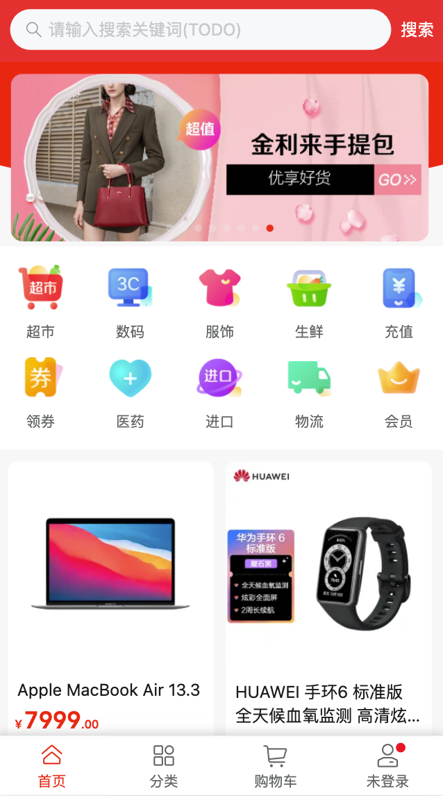
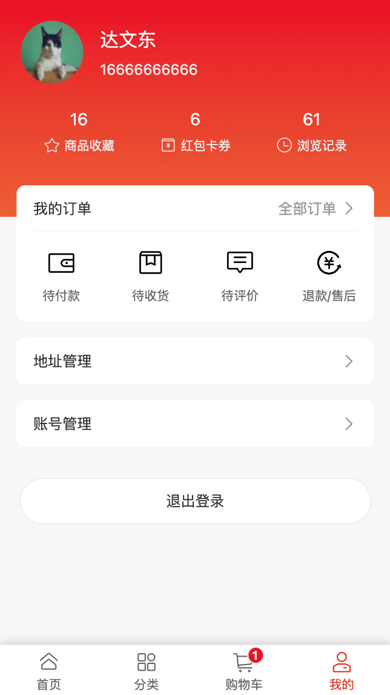

# pinxixi-client
## 系统简介
拼西西商城H5客户端，主要基于Vue3.x及ts相关技术栈开发。商城已实现功能模块有：首页活动轮播及推荐商品展示、商品详情、商品分类、购物车、订单提交、订单支付、地址管理、账号管理等。

### 主要技术栈
+ Vue3.x
+ Vite2.x
+ Vant4.x
+ Typescript
+ Pinia

<br/>

## 在线体验
+ [H5客户端](http://119.29.134.117:3000/)（pxx/123456）
+ [后台管理系统](http://119.29.134.117:3001/)（admin/123456）

<br/>

## 开发
### 安装依赖

```bash
# with npm
npm install
# or with yarn
yarn
```
### 启动
```bash
# with npm
npm run dev
# or with yarn
yarn dev
```
### 本地打包
```bash
# with npm
npm run build
# or with yarn
yarn build
```

## 功能模块

- 用户模块
  - 用户登录/登出
  - 用户注册
  - 修改用户信息
- 首页模块
  - 轮播图
  - 推荐商品
- 商品模块
    - 商品详情
- 商品分类模块
- 购物车模块
    - 添加
    - 修改
    - 删除
- 个人中心模块
    - 我的订单
    - 地址管理
    - 账号管理

<br />

## 项目演示(部分)
<div>
  
  
  
</div>
<div>
  
  
  
</div>
<div>
  
  
</div>

<br />

## 问题记录

### 1. vant地址组件样式问题
>当有默认地区数据时，打开省市区弹框没有选中样式，省市区改变或样式才显示正常，官网例子也有同样的问题。